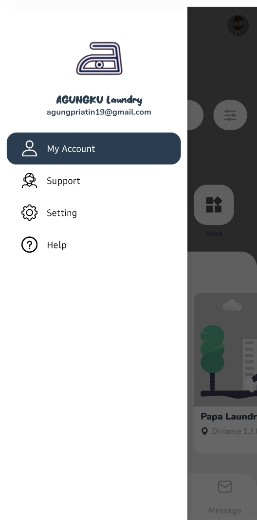
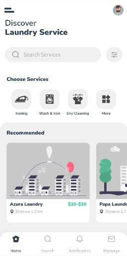
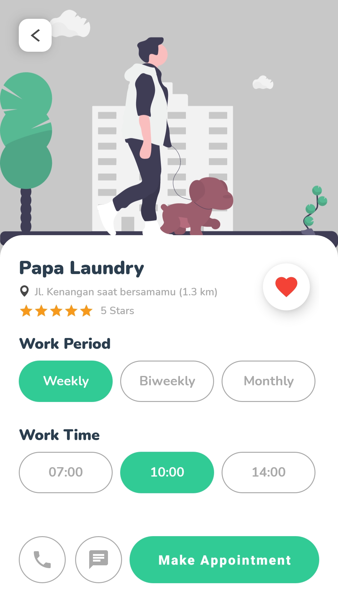
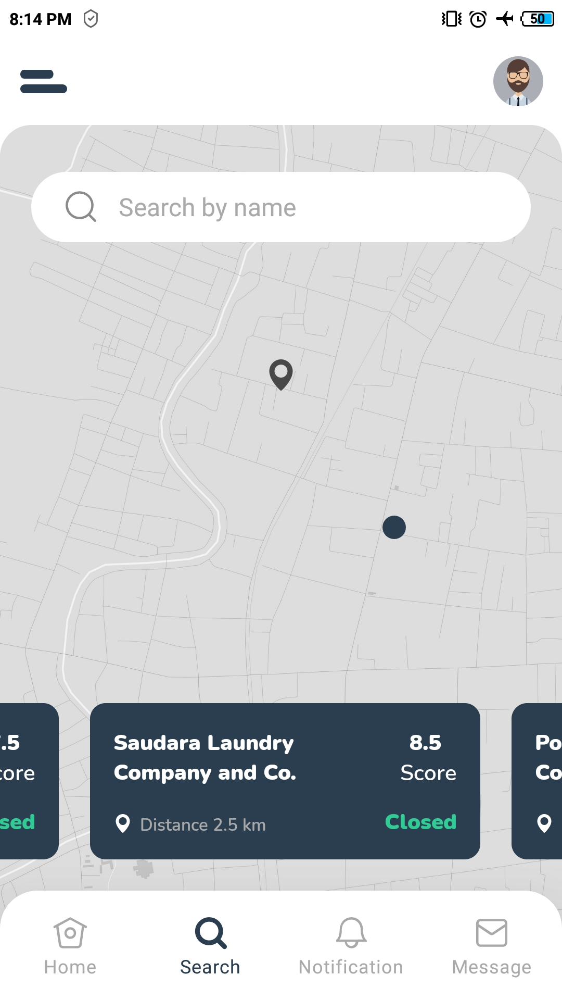
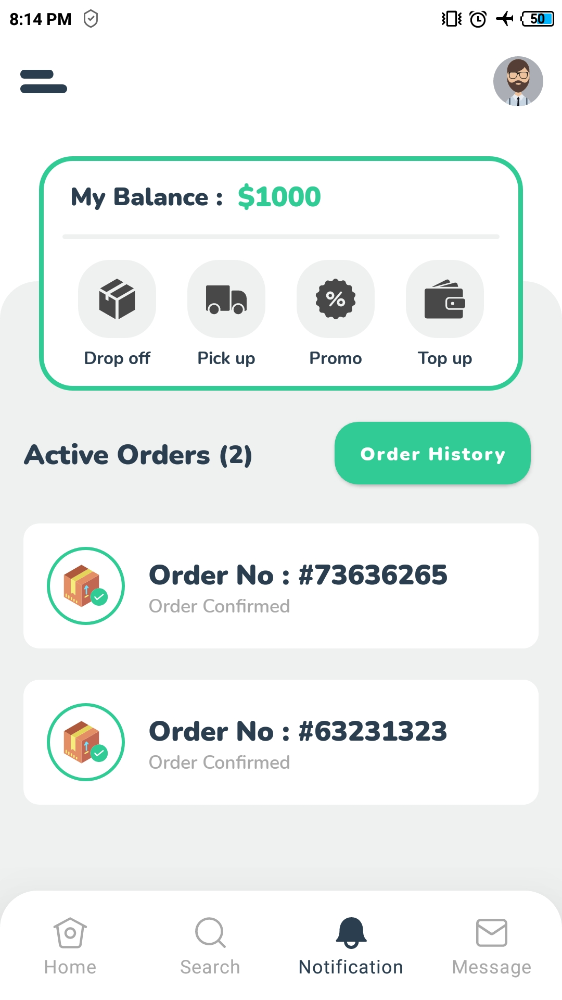
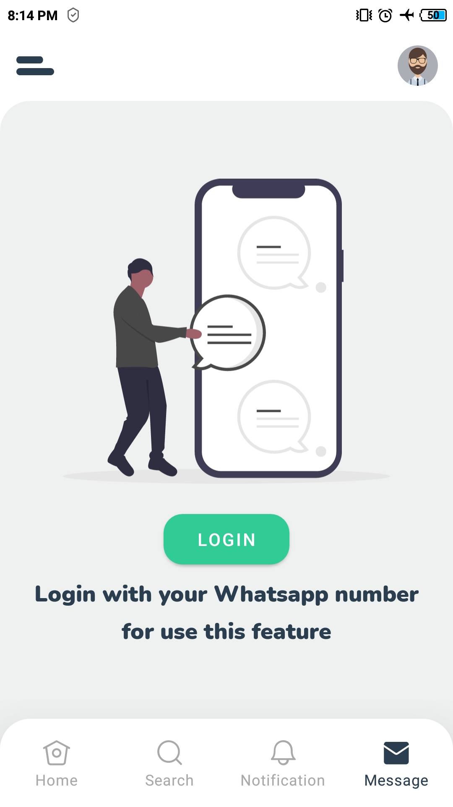

# Agungku Laundry

[](https://www.android.com)
[](https://www.apache.org/licenses/LICENSE-2.0.html)
[](https://docs.gradle.org/current/release-notes)
[](https://java-lang.github.io/awesome-java)

🛁 Agungku Laundry

# Source
Repo to demonstrate Laundry App UI in Android app. This is a follow up on the source at :

- [Dribble](https://dribbble.com/tags/laundry_app)
- [Medium](https://medium.com/@RayLiVerified/create-a-bottom-navigation-bar-the-easy-way-part-1-ec2f5f9122b)
- [Flat Icon](https://www.flaticon.com)
- [UnDraw Illustration](https://undraw.co)
- [Alvarcarto Maps](https://alvarcarto.com)
- etc.

# Demo App

<p align="center">
  <a href="https://github.com/Agungpriatin/Agungku">
    
  </a>
</p>

<table style="width:100%">
  <tr>
    <th>Example 1</th>
    <th>Example 2</th>
    <th>Example 3</th>
  </tr>
  <tr>
    <td></td>
    <td></td>
    <td></td>
  </tr>
  <tr>
    <th>Example 4</th>
    <th>Example 5</th>
    <th>Example 6</th>
  </tr>
  <tr>
    <td></td>
    <td></td>
    <td></td>
  </tr>
</table>

# License

```
    Copyright (C) Agung Priatin

    UI Ini di buat dengan waktu yang cukup panjang dan fokus
```
